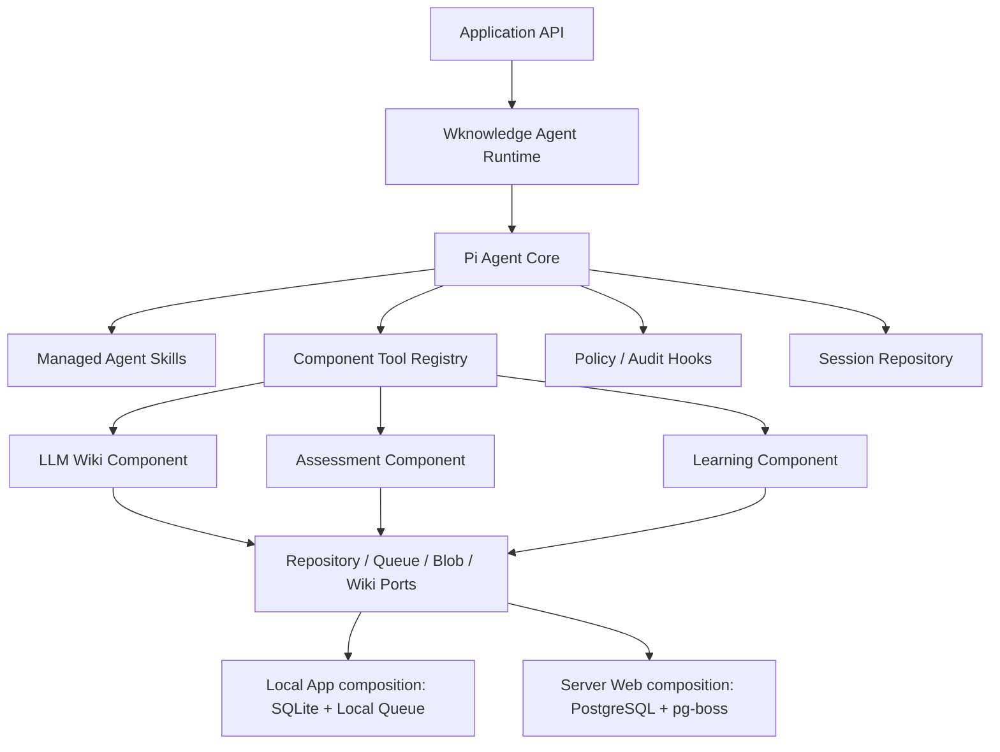

# ADR 0004：Pi 核心与可组合领域组件

- 状态：接受，待实施
- 日期：2026-08-17
- 取代：M5-00 中“Pi 仅保持未安装候选”的产品方向；M5-00 的安全轨迹和供应链门禁继续有效

## 背景

当前项目已经实现 Markdown Wiki、来源回溯、权限、学习与测评切片，但 Agent 核心仍是内部脚本事件 Adapter；Skill 使用自有 `skill.json`，领域服务大量直接依赖 PostgreSQL Schema。继续沿此路径会让每个 App 重复携带对话循环、Skill 管理和数据库实现，也不利于兼容用户本地 Agent Skills。

产品目标调整为：Pi 管理对话与 Skill 使用，LLM Wiki、Assessment、Learning 作为可组合外部领域组件，本地和线上使用不同存储运行档案。

## 决策

1. `@earendil-works/pi-agent-core` 成为 Web、Desktop 和 Mobile 的默认 Agent Loop 核心；服务器正常请求不得先进入内部 Loop 再转 Pi。
2. `@wknowledge/agent-runtime` 保留为反腐层，负责将 Pi 事件、工具和状态映射为 Wknowledge 契约，业务代码不直接依赖 Pi 类型。
3. 不嵌入 Pi TUI 或完整 Coding Agent CLI；不启用默认 Bash、Write、Edit、任意 Read 等工具。
4. 使用 tenant-scoped ResourceLoader。它只返回当前组织已安装、当前会话可见的 `SKILL.md` 和 Tool，不隐式扫描服务器用户目录。
5. LLM Wiki、Assessment、Learning 分别拥有 Tool/API、领域服务、Repository 和迁移；Skill 只描述如何组合这些 Tool。
6. Wknowledge Policy、Approval、Model Gateway、SourceLocator、审计和 Worker Sandbox 继续拥有最终控制权。
7. Repository 和 JobQueue 使用 Port/Adapter，但由**不同组合根**固定装配：本地 App 为 SQLite/local queue，服务器 Web 为 PostgreSQL/pg-boss；不得用同一个 Web 环境变量在两者间切换。
8. 迁移采用“旁路接入 → 等价验证 → Pi 切默认 → 观察期 → 删除旧路径”，不长期维护双核心。切默认后 internal 只可经显式应急配置进入并写审计，不是正常生产路径。

## 组件关系

## Skill 与 Tool 的区别

- `SKILL.md`：面向模型的渐进式工作流说明。
- Tool：面向 Pi 的结构化可调用接口。
- Component：Tool 背后的领域实现、数据、迁移和测试。
- Sandbox Program：只有声明受支持执行清单、通过审批与隔离后才能运行的脚本。

任何 Skill 文本都不能直接授予权限、构造数据库连接或扩大知识范围。

## 选择 Pi 的理由

- 复用成熟的流式 Agent Loop、Tool Call、取消、上下文转换和工具前后 Hook。
- 对齐 Agent Skills 标准和 `SKILL.md` 生态，减少自有格式锁定。
- 允许知识、考试和学习组件复用同一对话核心，而不复制运行时。
- Pi 仍位于 Wknowledge Adapter 后，未来可以替换而不改变领域对象和历史数据。

## 代价与控制

- 上游供应链和 API 变化：锁定版本/commit、包摘要和依赖树，升级重跑契约测试。
- Node Engine 漂移：S0 将项目、CI、容器和本地安装器统一到所选 Pi 版本支持的 Node 基线。
- Pi 默认不提供多租户 RBAC 或业务审计：所有 Tool Call 必须经过 Wknowledge Hook。
- Pi Skill/Package 可能包含任意指令或代码：服务器禁止默认目录发现，安装先扫描、固定摘要和人工确认。
- 双运行期间复杂度上升：设定明确删除门禁和截止 Sprint，不保留永久兼容层；SQLite 是本地 App 交付，不是云端 Web 的降级数据库。

## 被拒绝的方案

- 继续扩展内部 Agent Loop：重复建设成熟能力，Skill 生态兼容成本高。
- 直接运行完整 Pi Coding Agent：权限面过宽，不适合多租户知识平台。
- 让 LLM Wiki 只作为 Skill：缺少稳定 Tool、领域服务、迁移和存储边界，无法保证来源与事务。
- 将所有模块塞入一个 SQLite 文件且直接共享表：组件无法独立演进，线上 PostgreSQL 适配仍会泄漏到领域代码。

## 结果

后续 Agent、考试和学习功能必须先接入组件 Tool Contract，再由 Skill 编排；不得新增绕过 Pi 核心的专用模型循环。服务器已切 Pi 为正常入口，旧内部路径只允许用于迁移对照或显式应急，达到清理门禁后删除。本地 SQLite 只由本地 App 组合根使用。
