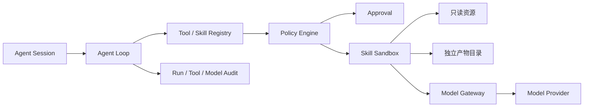

# Agent、Skill 与模型运行时设计 v1

## 1. 目标

提供可扩展但默认受限的执行环境，使知识加工、学习诊断和评测能力可以由 Skill 增加，同时保证资源权限、网络、模型、预算和审批可审计。

## 2. 组件关系



## 3. Agent Loop

一次 Agent Run 包含：

1. 固定系统策略与用户目标。
2. 当前知识空间和数据策略。
3. 按需加载的工具/Skill 描述，不全量注入。
4. 模型提出工具调用。
5. Policy Engine 验证参数、权限、预算和审批。
6. 执行结果以不可信工具输出返回模型。
7. 达到答案、拒答、预算、超时或人工交互条件后停止。

禁止模型自行修改系统策略、权限、批准状态和资源范围。

### 3.1 对话工作区

知识问答从单次 Query 演进为可恢复的 `AgentSession`：

```text
AgentSession
├── Message[]                 # 用户、助手、工具结果和 UI 事件
├── KnowledgeContextBinding[] # 本会话可读知识库及虚拟路径
├── EnabledSkill[]            # 本会话允许发现的 Skill
├── AgentRun[]                # 每轮执行、停止原因与成本
└── EvidenceSnapshot[]        # 回答当时的页面与资源版本
```

- 新建会话时显式选择知识空间；会话中可增加或移除上下文绑定。
- 每次运行开始和每次工具调用前重新验证当前用户对绑定空间的权限。
- 历史消息保留原绑定和证据快照；移除权限后不可继续读取正文，但审计记录保留。
- 支持流式文本、工具调用进度、停止、继续、失败恢复和会话重命名。
- 上下文超过模型窗口时，先保留系统策略、最近消息、未完成工具状态和引用证据，再压缩较旧消息。

### 3.2 受管知识路径

用户看到的“添加知识库路径”使用平台虚拟路径，不接受任意主机路径：

```text
/knowledge/{spaceId}/wiki/index.md
/knowledge/{spaceId}/wiki/topics/{pageId}.md
/knowledge/{spaceId}/compiled/{resourceVersionId}/nodes.json
```

运行时只提供以下受控工具：

- `knowledge.list`：列出当前会话已绑定空间和根索引。
- `knowledge.search`：执行 index-first Markdown 检索，MVP Embedding 调用固定为 0。
- `knowledge.read`：按稳定页面 ID 或受管相对路径读取 Wiki/compiled 片段。
- `source.open`：把引用解析为 SourceLocator 和授权预览地址。
- `skill.load`：按需加载会话允许的 Skill 描述与输入 Schema。

虚拟路径由服务端解析为 `spaceId + objectId`，不能用 `..`、符号链接或绝对路径逃逸。Agent 不获得通用 Bash、宿主文件读取或数据库工具。

当前范围分阶段实现：整空间为 `/knowledge/{spaceId}`；精确范围使用服务端生成的 `/knowledge/{spaceId}/wiki/pages/{pageId}` 和 `/knowledge/{spaceId}/resources/{resourceVersionId}`。它们分别绑定已发布 Wiki stable ID 和不可变资源版本，先在 Markdown 检索评分前过滤，再进入 EvidenceBundle、模型和来源快照。课程范围只能引用已确认的 Course/Unit 快照，不能将“当前课程”或路由字符串作为动态权限范围。

### 3.3 Skill 参与对话

- 会话默认只暴露基础知识工具；Skill 只注入名称、描述和风险摘要。
- 模型或用户选择 Skill 后，Policy Engine 计算 `allow/ask/deny`，通过后再加载完整说明。
- Skill 运行结果作为不可信工具输出进入会话，并保存 Skill ID、版本、digest、输入摘要和产物。
- 学习计划、课程编排、练习生成和报告解释均复用同一 Agent Loop，不创建绕开权限的第二套模型调用链路。

### 3.3.1 Skill 驱动的知识对话边界

对话中的 Skill 不是通用命令工具。其输入只来自服务端根据 `AgentContextBinding`、当前轮 EvidenceBundle 和已批准的用户意图生成的受控 JSON；不传递宿主路径、Blob URI、数据库连接、模型密钥、完整 Wiki 或上传文件中的可执行指令。

```text
用户意图 / 已选 Binding
→ Policy + Approval
→ 固定 Manifest + SkillRun 快照
→ Worker Sandbox
→ Schema 校验的受控输出
→ 脱敏 Tool 结果 / 独立来源区
```

- `knowledge.search/read` 负责取证；Skill 不能绕过它重新扩大知识范围。
- 计划、练习和测评 Skill 只能写入待领域服务重核的 draft/candidate 产物，不能直接写 LearningPlan、Attempt、Grade、Mastery 或 Report 终态。
- 对话轨迹将模型自然语言、Tool/Skill 状态和来源分别保存、分别展示，避免把检索结果或不可信 Skill 输出伪装成最终答案。

### 3.4 对话事件与流式边界

Web 只负责创建运行、订阅事件和请求停止；长 Agent/Skill 执行进入 Worker。当前 `M5-02` 例外仅限于受管 Markdown 的短时 `wiki-query` 与有据回答：它使用请求生命周期内 SSE，不运行实际 Skill、文件处理或媒体任务，也不能替代后续 Worker 事件投递。SSE 事件采用只追加顺序，刷新后由持久化运行记录补齐：

```text
run.created
→ context.resolved
→ tool.requested
→ approval.requested | tool.started
→ tool.completed | tool.failed
→ answer.delta*
→ evidence.attached
→ run.completed | run.stopped | run.failed
```

- `answer.delta` 不是业务真相源；完成时的 Assistant Message、EvidenceSnapshot、ToolCall 和 SkillRun 才写入数据库。
- 用户停止只取消当前 Run，不删除已确认的消息、来源或学习记录。
- 所有工具事件都包含运行 ID、事件序号和可展示的脱敏摘要；错误详情不透传模型密钥、宿主路径或原始堆栈。

## 4. Skill 生命周期

```text
发现 → Manifest 校验 → 摘要验证 → 安装/启用
→ 输入校验 → 权限计算 → 审批 → 隔离执行
→ 输出校验 → 产物登记 → 审计 → 完成/失败
```

### 4.1 Manifest

沿用 `SkillManifest`，并在完整实现时增加：

- `runtime`: `node | python`
- `compatibility`: 平台和运行时版本范围
- `networkAllowlist`: 域名、端口和协议，不接受任意 URL 数组替代策略
- `artifactTypes`: 允许产生的文件类型
- `riskLevel`: `low | medium | high`
- `publisher` 与可选签名

### 4.2 权限计算

有效权限是以下集合的交集：

```text
系统策略 ∩ 组织策略 ∩ 空间策略 ∩ 用户角色 ∩ Skill Manifest ∩ 本次批准
```

任一层拒绝即拒绝，不允许下层扩大上层权限。

### 4.3 审批

| 动作                   | 默认审批                      |
| ---------------------- | ----------------------------- |
| 读取用户明确选择的资源 | never/conditional             |
| 读取整个空间           | conditional                   |
| 写入独立产物目录       | conditional                   |
| 修改已发布 Wiki        | always，先生成 diff           |
| 出网                   | always 或组织预批准 allowlist |
| 发送正文到云模型       | 由数据策略和审批共同决定      |
| 删除、发布、邀请用户   | always                        |

批准必须绑定 Skill 版本、参数摘要、资源范围和过期时间，不能永久批准模糊动作。

当前 M5-04/M5-05 已落地最小审批记录：会话所有者可处理自己的 `pending` 项；记录固定 Skill version/digest、active Binding ID、最长 500 字符输入摘要和十分钟过期时间。`approved` 不是执行许可的终点，Worker 运行前仍需重新检查组织启停、Manifest、数据策略、范围和 Sandbox。拒绝、过期及已处理记录不可改写。

## 5. 隔离设计

### 5.1 文件系统

```text
/run/{skillRunId}/
├── input/        # 只读选择资源或受控副本
├── work/         # 临时可写，运行结束清理
└── artifacts/    # 可写，输出校验后登记
```

- 不挂载宿主机工作区、用户主目录、`.env` 和 Docker socket。
- 入口路径在安装时解析并固定，运行时不接受用户覆盖。
- 防止符号链接逃逸和路径穿越。

### 5.2 进程与资源

- 非 root 用户、只读根文件系统、最小 Linux capabilities。
- CPU、内存、进程数、输出大小和墙钟超时限制。
- stdout/stderr 限长并脱敏。
- 终止时清理子进程树。

### 5.3 网络

- 默认 deny。
- allowlist 在网络层执行，不只靠提示词。
- 禁止访问环回、私网、云元数据和未授权 DNS 结果。
- 记录目标域名、端口、字节数和结果，不记录敏感正文。

## 6. 提示注入边界

上传文档、网页、OCR、ASR 和工具输出统一包装为不可信内容：

```text
系统策略 > 开发者策略 > 用户任务 > 已批准工具参数 > 不可信资料正文
```

资料中的“忽略规则、访问其他空间、调用工具、泄露提示词、出网”等文本仅作为被分析内容。Policy Engine 不读取自然语言来决定权限。

## 7. Model Gateway

### 7.1 Provider 模型

```ts
interface ProviderRegistration {
  id: string;
  location: "local" | "cloud";
  capabilities: ModelCapability[];
  models: ModelRegistration[];
  health: ProviderHealth;
  policyTags: string[];
}
```

Provider 适配器负责供应商协议；Gateway 负责策略、选择、fallback、重试、审计和预算。

首个纵向切片采用服务端环境变量注册 OpenAI-compatible Provider，可连接本地 Ollama/vLLM 或兼容云端接口。`BASE_URL` 与 `MODEL` 同时存在才启用；API Key 不进入浏览器响应。首切片在每次调用前执行合成健康检查，Provider 管理、健康缓存和数据库密钥引用由 M5-08 后续工作补齐。

### 7.2 路由顺序

```text
数据策略
→ 组织/空间允许列表
→ 所需能力和上下文限制
→ 健康状态
→ 质量等级
→ 延迟和成本
→ fallback 链
```

### 7.3 能力边界

- Wiki MVP 查询不调用 `embedding`。
- 知识问答先形成可验证 EvidenceBundle，再调用 chat；模型输出引用必须是证据包 ID 的子集。
- 未配置 chat Provider 时只能显示明确标记的检索摘要模式，不能伪装成自然语言智能回答。
- `local_only` 不得选择 cloud Provider。
- vision、ASR、TTS 和视频理解分别注册，不假设 chat 模型支持。
- fallback 只在同一数据策略范围内。
- 健康检查只发送合成数据。
- `cloud_allowed_after_redaction` 在脱敏器完成前不得选择云 Provider。
- Provider 输出必须经过 GroundedAnswer Schema 与 Evidence ID 子集校验；非 JSON、引用越界和超时均降级为明确标记的检索摘要。

### 7.4 调用记录

保存：Provider、模型、能力、策略结果、输入/输出摘要、token/费用、延迟、关联对象和错误码。敏感正文默认不保存；需要调试时使用短期、审批和脱敏的诊断模式。

## 8. 运行记录数据模型

完整实现需增加：

- `agent_session`
- `agent_run`
- `tool_call`
- `skill_definition`
- `skill_installation`
- `skill_run`
- `approval_request`
- `model_provider`
- `model_registration`
- `model_call`
- `artifact`

所有记录保留 Skill digest、模型 ID、输入摘要和来源，支持重放决策但不自动重放高风险动作。

`agent_context_binding` 是 Session 下独立的版本化范围记录，至少保存空间、范围类型、目标对象、服务端生成的虚拟路径、显示标签、创建人、状态和每轮授权快照。它不保存 host path，不复制 Wiki 正文，也不能成为绕过 ResourceVersion 的别名。

## 9. 内置 Skill 分组

| 分组 | Skill                                        | 所需能力         |
| ---- | -------------------------------------------- | ---------------- |
| Wiki | wiki-compile/query/lint/correct              | chat 可选        |
| 解析 | document-parse/ocr/asr/video-extract         | vision/STT/video |
| 学习 | learner-diagnose/plan-compose/course-compose | chat             |
| 题目 | practice-generate/assessment-generate        | chat             |
| 评分 | objective-grade/rubric-grade                 | 无模型/chat      |

确定性能力优先用代码实现，例如 Schema 校验、客观题评分、权限判断和索引遍历。

### 9.1 学习 Skill 的职责拆分

| Skill                     | 输入边界                             | 输出边界                | 最终状态写入者                      |
| ------------------------- | ------------------------------------ | ----------------------- | ----------------------------------- |
| `plan-compose`            | 已选内容、目标、画像摘要             | 带来源的 draft 计划候选 | LearningPlan 领域服务，且须用户确认 |
| `practice-generate`       | 已学范围、知识点、难度、本人历史摘要 | 待校验练习题候选        | Assessment 领域服务                 |
| `assessment-generate`     | 指定测评范围和规则                   | 待审核题卷候选          | Assessment 发布流程                 |
| `objective-grade`         | 固化题目版本与作答                   | 确定性分数、规则命中    | Grade 领域服务                      |
| `rubric-grade`            | 固化题目、作答、量表                 | 建议分、理由、置信度    | Grade/复核流程                      |
| `learning-report-explain` | 确定性报告指标                       | 带标记文字建议          | Report 领域服务保留指标真相         |

Skill 不持有跨用户学习记录读取权限，不直接把候选题标为 published，不直接修改掌握度，也不直接渲染最终报告图片。

## 10. 验收标准

- 无网络权限 Skill 的系统调用层面无法出网。
- 原始文件挂载只读，写入尝试失败并进入审计。
- 超时、内存和输出超限的进程被终止。
- 未批准高风险动作不能执行。
- 文档提示注入不能扩大权限或访问其他空间。
- 每个输出可追溯到 Skill digest、模型和来源。
- Provider fallback 不突破空间数据策略。
- Wiki 查询运行记录中的 Embedding 调用数为 0。
- 会话挂载未授权空间、任意绝对路径或路径穿越输入时均被拒绝。
- 多轮对话、停止、恢复和上下文压缩后，回答引用仍指向当时的页面与资源版本。
- Skill 未获会话权限时不出现在可加载清单中，`ask` 未批准时不能执行。

## 11. 开源框架采用策略

- Pi：优先评估 `pi-agent-core` 的事件流、消息转换、上下文裁剪、工具前后拦截和会话状态；不采用其 Coding Agent 的主机文件与 Shell 权限默认值。
- OpenCode：借鉴 Skill 按需发现以及 `allow/ask/deny` 的模式匹配；Wknowledge 的最终权限仍由服务端 Policy Engine 判定。
- Claude Code：只借鉴官方公开的 Skills、Hooks、工具拦截、权限顺序和会话体验；不把 Claude Code CLI 视为可嵌入的开源运行时。
- 采用任何依赖前完成许可证、维护活跃度、供应链、包体积、Provider 锁定和安全边界 Spike；未通过时保留内部适配器实现。
- Agent core、Skill registry、Model gateway 和 UI 之间使用 Wknowledge 自有契约，第三方框架不得成为数据库或知识真相源。
