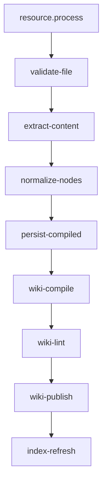
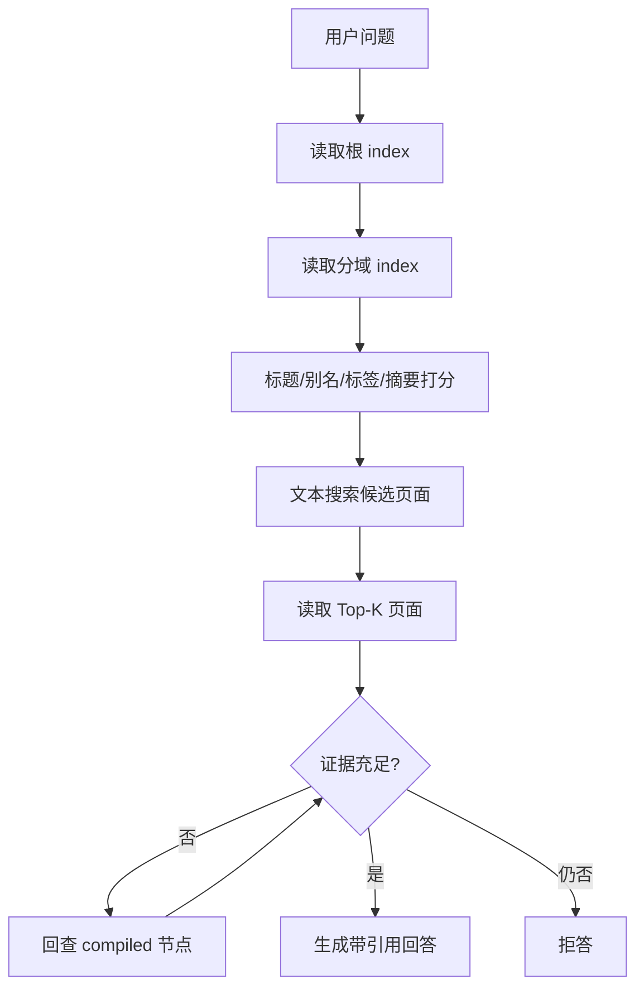

# 资源入库、Wiki 与回源设计 v1

## 1. 范围

本设计覆盖文件上传、不可变版本、解析节点、Wiki 编译、知识浏览、查询和来源预览。它是 M2–M4 的实现依据。

## 2. 目录契约

```text
data/spaces/{spaceId}/
├── KNOWLEDGE.md
├── raw/                         # 可选导出视图；原始 Blob 本身不可变
├── compiled/{resourceVersionId}/
│   ├── content.md
│   ├── nodes.json
│   ├── assets/
│   └── parser-manifest.json
├── wiki/
│   ├── index.md
│   ├── log.md
│   ├── concepts/
│   ├── topics/
│   ├── cases/
│   ├── courses/
│   ├── materials/
│   └── indexes/
└── mappings/
    ├── source-map.jsonl
    └── publish-manifests/
```

## 3. 上传协议

上传不仅声明文件，还必须声明 `compileProfile`：`knowledge`、`case` 或 `reference`。它属于不可变 `ResourceVersion`，决定 Wiki 编译结构，但不得改变 Parser 对源内容的忠实提取。历史版本默认 `reference`；同一哈希只在同一模式内去重。

### 3.1 客户端流程

- 小文件可以直接 multipart 上传；达到阈值后必须分片上传。
- 上传前展示类型、大小、空间和数据策略。
- 进度区分“上传中”和“服务器处理中”。
- 创建任务后订阅 `/api/jobs/{jobId}/events`。
- 任务完成后自动刷新资源和 Wiki 页面列表。

### 3.2 服务端检查

| 检查                       | 失败码                 |
| -------------------------- | ---------------------- |
| 空间编辑权限               | `SPACE_ACCESS_DENIED`  |
| 文件为空或超限             | `UPLOAD_SIZE_INVALID`  |
| 扩展名/MIME/文件签名不一致 | `UPLOAD_MIME_MISMATCH` |
| 压缩包膨胀比超限           | `ARCHIVE_BOMB_RISK`    |
| 路径或文件名不安全         | `UPLOAD_NAME_INVALID`  |
| 空间配额不足               | `SPACE_QUOTA_EXCEEDED` |

哈希去重只在同一授权空间内复用逻辑结果，不跨空间暴露文件是否存在。

## 4. 标准解析节点

```ts
interface CompiledNode {
  schemaVersion: 1;
  id: string;
  kind: "heading" | "paragraph" | "table" | "image" | "slide" | "transcript";
  title?: string;
  content: string;
  parentId?: string;
  order: number;
  locator: SourceLocator;
  metadata: Record<string, unknown>;
}
```

`CompiledDocument` 顶层同时保存 `schemaVersion/resourceVersionId/nodes`。`id` 在同一资源版本和 Parser 版本内稳定；ID/order 唯一，父节点必须早于子节点，Locator 必须与顶层 ResourceVersion 一致。

`parser-manifest.json` 是独立可校验产物，必填 `schemaVersion/parserId/parserVersion/runtime/mimeType/resourceVersionId/generatedAt`。Worker 必须在写盘和 Wiki 编译前运行 Zod 校验；TypeScript 类型断言不能代替运行时验证。

## 5. 分类型解析策略

| 类型     | 必须提取                                                                              | SourceLocator   | M2/M4            |
| -------- | ------------------------------------------------------------------------------------- | --------------- | ---------------- |
| TXT/MD   | 标题、段落、列表、代码块                                                              | document nodeId | M2               |
| PDF      | 页面文本、阅读顺序、图片、表格                                                        | page + bbox     | M2 基础，M4 精确 |
| DOCX     | 标题层级、段落、表格、图片、批注                                                      | document nodeId | M2               |
| PPTX     | 幻灯片、Shape、备注、图片、表格                                                       | slide + shapeId | M4               |
| XLSX/CSV | 工作表、范围、公式、显示值、合并单元格                                                | sheet + range   | M4               |
| 图片     | OCR 文本、区域、视觉描述                                                              | image + bbox    | M4               |
| 音频     | 带时间戳转写、可选说话人                                                              | audio start/end | M4               |
| 视频     | MP4 容器、时长、流清单、文本型内嵌字幕和条件化第一音轨转写；后续关键帧、画面 OCR/描述 | video start/end | M4-06 分阶段     |

解析器只能输出事实提取；模型补全必须标记为 `ai_completed`，不能伪装成原文。

XLSX 以只读行迭代配对缓存值和公式，不能构造整张工作表的二维数组。解析前固定限制 64 个工作表、每表 50,000 行/256 列/1,000,000 声明单元格、整本 2,000,000 声明单元格；超限以 `XLSX_DIMENSION_LIMIT` 失败，不发布局部节点。

CSV 只读取前 8 KiB 识别 delimiter，随后回卷为文件行迭代；最多 50,000 行/256 列/1,000,000 个声明单元格，超限以 `CSV_DIMENSION_LIMIT` 失败，不发布局部节点。

## 6. 任务分解



每个阶段都写入 `stage/progress`，失败后保留已完成的可重用阶段。重试必须从最后一个可验证检查点开始。

## 7. Wiki 编译规则

### 7.1 输入

- 当前空间的已发布 Wiki。
- 本次 `ResourceVersion` 的 compiled 节点。
- 来源映射和人工审核状态。
- 编译策略与 Skill 版本。

### 7.2 输出

- 新增、更新、冲突和弃用页面集合。
- 新的根索引和分域索引。
- 来源映射增量。
- 编译 diff、Lint 报告和发布清单。

### 7.3 幂等键

```text
spaceId + resourceVersionId + compileSkillVersion + compilePolicyVersion
```

相同输入重复编译不能产生重复页面、重复来源或不同稳定 ID。

### 7.4 合并策略

| 情况               | 行为                             |
| ------------------ | -------------------------------- |
| 完全相同事实与来源 | 合并来源，不重复正文             |
| 新来源补充同一事实 | 更新页面，追加来源               |
| 来源结论冲突       | 并列展示，状态 `conflicted`      |
| 页面已人工确认     | 生成候选 diff，等待批准          |
| 旧资源版本被替换   | 保留历史来源，当前页可标记新版本 |

## 8. Wiki Lint 门禁

- Frontmatter 符合 Schema，页面 ID 唯一。
- `sourceRefs` 至少一个且全部可解析。
- 内部链接目标存在，无循环索引错误。
- `reviewed` 页面未被未批准覆盖。
- 索引覆盖所有可见页面，不列出 deprecated 页面。
- 同一路径不存在大小写冲突或路径穿越。
- 页面正文没有密钥模式和危险 HTML。
- 发布清单与 staging 文件摘要一致。

任一错误级问题阻止发布；警告进入知识质量队列。

## 9. 知识浏览 UI

工作台不能只显示原始资源，必须有独立 Wiki 区域：

```text
空间
├── 资料库：用户上传的逻辑资源和处理状态
├── 知识库：已发布 Wiki 目录、页面和审核状态
├── 知识问答：索引查询与引用
└── 学习：计划、课程和测评
```

这些功能域必须使用独立 App Router 页面，而不是堆叠在同一页面的锚点区块：

```text
/workspace/resources  资料库
/workspace/wiki       知识库
/workspace/query      知识问答
/workspace/learning   学习应用入口
```

`/workspace/layout.tsx` 只管理共享侧栏、空间选择和全局通知；功能数据由对应页面按需加载。左侧导航使用真实 URL，并为当前页面提供 `aria-current="page"`。

### 9.1 Wiki 列表

- 分域目录、标题、摘要、标签、状态、来源数、更新时间。
- 默认“知识内容”只包含 topic、concept、case、course；material 放入独立“资料索引”。
- 知识内容允许多选页面类型；资料索引提供返回资料库管理原文件的入口。
- 搜索范围是标题、别名、标签和 Markdown 正文。
- 可筛选 `draft/reviewed/conflicted/deprecated`。
- 显示“来自哪些资源”，但不暴露服务器路径。

### 9.2 Wiki 阅读页

- 正文、目录、相关页面和来源面板。
- extracted/synthesized/ai_completed 使用不同标识。
- 引用可打开来源预览。
- editor 可发起纠错、审核和查看 diff。

## 10. 查询设计



查询运行记录必须保存读取过的索引、候选页、最终引用和是否调用模型。MVP 中 `embeddingCalls` 必须为 0。

M3-10 先把候选页标准化为 EvidenceBundle：每项包含稳定 Evidence ID、Wiki 页面、命中摘录和该页面自身来源。Agent 的 GroundedAnswer 只能引用包内 ID；未配置 chat Provider 时必须标记 `extractive_fallback`，UI 把回答、证据摘录和原资料定位分层显示。

## 11. 来源预览

| 定位类型    | UI 行为                               |
| ----------- | ------------------------------------- |
| PDF         | 打开指定页，bbox 高亮并滚动到可见区域 |
| audio/video | 跳转到 startMs，突出当前转写片段      |
| sheet       | 打开指定工作表，选中 range            |
| slide       | 打开指定幻灯片，高亮 shapeId          |
| document    | 滚动到 nodeId 对应结构节点            |
| image       | 显示图片并覆盖 bbox                   |

预览接口先检查资源所属空间权限，再返回受控内容；不得接受任意文件路径。

## 12. 验收数据集

- 每类至少 20 个真实文件，覆盖扫描件、复杂表格、乱码和损坏文件。
- 100 份资料建立 50 个黄金问题和预期来源。
- PDF 随机抽样 200 个引用，位置准确率 ≥ 95%。
- 音视频 100 个片段，误差不超过一个转写分段。
- 表格 100 个引用全部打开正确工作表和范围。
- 删除检索缓存后黄金问题仍可完成基础查询。
