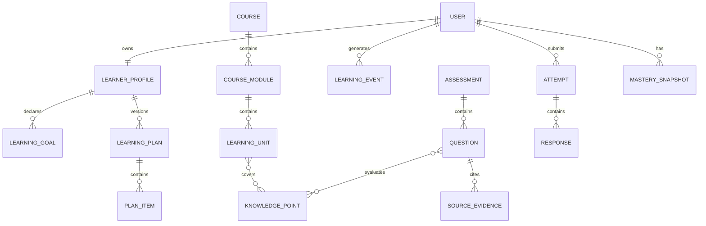

# 学习应用领域设计 v1

## 1. 目标

在可追溯知识库之上建立用户可确认、历史不可变、证据可回查的学习计划、课程、练习与测评系统。

## 2. 领域模型



## 3. 学习画像

画像数据必须分层：

| 层       | 来源         | 示例                   | 用户能否修改           |
| -------- | ------------ | ---------------------- | ---------------------- |
| declared | 用户主动填写 | 目标、时间、基础、偏好 | 可以                   |
| observed | 系统事件     | 学习时长、完成、错误   | 不能直接改，可纠错事件 |
| inferred | AI/规则推断  | 掌握薄弱、节奏建议     | 可以确认或否定         |

推断记录必须保存依据、算法/模型、Skill、置信度、时间和确认状态。

## 4. 学习计划

- 计划生成结果先进入 `draft`。
- 用户确认后形成不可变 `active` 版本。
- 调整计划创建新版本，旧版本继续解释历史行为。
- 每项计划关联目标、课程/知识点、建议时间、完成条件和生成依据。
- 系统可以建议，但不能未经确认改变生效计划。
- 计划输入必须保存用户选择的空间、资源版本、Wiki 页面或课程范围，不能用模糊的“整个知识库”替代来源范围。
- 生成型 `plan-compose` 输出进入领域服务时，必须附带已完成 SkillRun 的 ID/version/digest；领域服务重新校验该 Run 的 Binding 可覆盖每个所选 ResourceVersion、每个 Unit 的 SourceLocator 与选择快照一致。通过后也只能写入 `draft`，确认流程才可创建 active Plan/Course。
- `plan-compose` 候选正文属于受限候选产物，不写入通用 SkillRun 摘要或审计。候选产物与 SkillRun 一对一，物化时加锁并记录最终 LearningPlan ID，避免重复 Run 领取或并发点击创建多个计划版本。

## 5. 课程结构

```text
Course
└── Module
    └── LearningUnit
        ├── KnowledgePoint
        ├── ResourceVersion / WikiPage
        ├── LearningActivity
        └── CompletionRule
```

学习单元不是文件播放列表，必须说明学习目标、学习动作、可观察输出和反馈方式。

### 5.1 内容选择与原文阅读

- 计划生成前，用户可以按资料、Wiki 页面、知识类型和课程范围选择内容。
- 学习单元保存不可变 `ResourceVersion`、Wiki 页面 ID、SourceLocator 和建议阅读范围。
- 文本/Markdown 使用结构节点阅读器；PDF 使用页码/区域；音视频使用时间轴、字幕和章节；图片、表格和幻灯片使用对应定位器。
- 阅读器记录 `opened/progress/bookmarked/completed` 事件；视频和音频只记录必要时间点，不持续上传用户播放遥测。
- 原文、Wiki 解释和 Agent 辅导分层展示，模型生成内容不能伪装成原文。

内容选择器不以“当前打开页面”做隐式输入。每一次计划候选必须显式持有选择快照：空间、资源版本、Wiki 页面、课程范围、知识类型过滤和 SourceLocator。用户可在确认前删除或调整项目；确认后计划引用的版本固定，后续资源更新不会悄然替换学习证据。

## 6. 学习事件

采用追加式事件记录：

```ts
interface LearningEvent {
  actor: "user" | "system" | "instructor";
  verb: string;
  objectType: string;
  objectId: string;
  result: Record<string, unknown>;
  context: Record<string, unknown>;
  occurredAt: string;
}
```

进度是事件派生状态，能够从事件重新构建。更正使用新事件，不覆盖旧事件。

## 7. 练习与测评

### 7.1 题目状态

```text
candidate → reviewed → published → retired
```

- candidate 可以由 AI 生成。
- published 必须经过规则校验，正式场景可要求人工审核。
- 每题绑定知识点、难度、题型、标准答案、评分量表和 SourceLocator。
- `ai_completed` 来源不能自动成为正式题目依据。

### 7.2 评分

| 类型                | 评分方式                       |
| ------------------- | ------------------------------ |
| 单选/多选/判断/填空 | 确定性代码                     |
| 数值/公式           | 容差和等价规则                 |
| 简答/论述           | 量表逐项评分，保存理由和置信度 |
| 实操产物            | 规则检查 + 人工/模型复核       |

低置信度、分数边界、用户申诉和模型不一致进入人工复核队列。

### 7.3 针对性练习流程

```text
已学内容 + 知识点 + 历史 Attempt + 难度目标
→ practice-generate Skill
→ 有来源的候选题
→ 规则/人工审核
→ 用户作答
→ 确定性或量表评分
→ 反馈、错题与掌握度事件
```

- 练习模式可即时生成，但题目仍需通过 SourceLocator、答案可判定性和重复题检查。
- 正式测评必须发布固定题卷版本；练习题不能在提交后被模型动态改写。
- 针对性只影响知识点、题型和难度选择，不得通过读取其他用户记录进行比较。

### 7.3.1 生成型学习 Skill 的写入边界

`plan-compose`、`practice-generate`、`assessment-generate` 与 `rubric-grade` 通过与对话相同的 `SkillRun → Worker Sandbox → Schema → 领域重核` 路径执行。它们分别只允许生成计划 draft、练习/测评 candidate、或主观题建议；确认计划、发布题卷、持久化最终 Grade、掌握度投影和报告指标由确定性领域服务负责。

Skill 输入按最小化原则提供：只包含当前学习者已选择/已完成的固定 Unit、KnowledgePoint、SourceLocator、目标难度及本人历史 Attempt 的脱敏统计。不得传入其他学习者记录、未完成单元、答案键、原始 Blob 或完整空间正文。

`practice-generate` 的候选题正文、答案键和量表属于受限候选产物，与完成的 SkillRun 一对一保存，不能写进 Run 通用摘要或审计。领域物化必须要求当前 active Course 的精确 course Binding，并逐题重核已完成 Unit、KnowledgePoint、ResourceVersion 与 SourceLocator 后才创建 `candidate` PracticeSet；同一候选只能物化一次。

### 7.4 学习报告与报告图片

- 报告输入只来自计划、学习事件、Attempt、Grade 和 MasterySnapshot 的版本化结构数据。
- 先生成 `LearningReport` JSON 与可访问 HTML，再由 Worker 渲染 PNG/PDF Artifact。
- 报告图片不是事实来源；每个指标可回查结构记录，AI 文字解释单独标记模型、Skill 和置信度。
- 报告包含时间范围、内容范围、完成率、练习表现、薄弱知识点、证据版本和下一步建议。
- 分享、下载和外发分别授权；默认只在私有部署内可见。

### 7.5 学习闭环状态机

```text
内容选择 completed
→ plan candidate
→ user confirmed active plan
→ learning unit opened/in_progress/completed
→ practice candidate
→ attempt submitted
→ grading completed | review_required
→ mastery snapshot
→ report requested
→ worker artifact completed | failed
```

- `plan candidate`、`practice candidate` 和模型解释均不能直接改变 `active`、`published`、`completed` 或最终评分状态。
- 原文阅读器写入追加 LearningEvent；进度由事件投影得出。重复事件须按事件 ID 幂等，撤销/纠正通过新事件表达。
- 报告请求是 Job：API 只创建请求与返回 `jobId`，Worker 读取版本化指标 JSON 后渲染 Artifact，不让 Next.js 请求进程生成图片或 PDF。

## 8. 掌握度

掌握度不是单一模型结论，而是基于事件的版本化快照：

- 证据类型与权重。
- 知识点和知识版本。
- 时间衰减策略。
- 当前分数和置信区间。
- 生成规则/模型版本。

用户否定 AI 推断后，系统保留原推断和纠正记录。

## 9. API 与 UI 模块

API：

```text
/api/learners/*
/api/learning-goals/*
/api/learning-plans/*
/api/courses/*
/api/learning-events/*
/api/assessments/*
/api/attempts/*
/api/reviews/*
/api/mastery/*
```

UI：学习首页、目标与画像、计划确认、课程播放器、练习、正式测评、结果解释、错题本、掌握度和人工复核。

补充 UI 路由：

```text
/workspace/learning/content       # 选择学习内容
/workspace/learning/plans/{id}    # 计划确认与版本
/workspace/learning/units/{id}    # 原文阅读/播放与辅导
/workspace/learning/practice      # 针对性练习
/workspace/learning/attempts/{id} # 作答结果与依据
/workspace/learning/reports/{id}  # 报告与图片导出
```

学习入口按以上独立路由组织；学习主页只显示概览和继续学习入口，不把内容选择、原文阅读、练习、报告全部堆叠在一个页面。学习单元页的正文、Agent 辅导、练习入口和来源导航须视觉分区，且正文阅读始终优先。

## 10. 验收标准

- 未确认计划不影响用户日程和进度。
- 学习事件可完整重建当前进度。
- 每道正式题能打开对应知识依据。
- 知识更新不改变历史题目、作答和评分证据。
- 用户能查看并纠正 AI 推断。
- 客观题重复评分结果一致。
- 主观题低置信度进入人工复核，不自动形成高风险结论。
- 文字和音视频学习进度可从事件重建，并能重新打开正确原文位置。
- 针对性练习只使用用户已授权且纳入学习范围的内容。
- 报告 JSON、页面和图片中的指标一致，任一指标可回查作答或学习事件。
