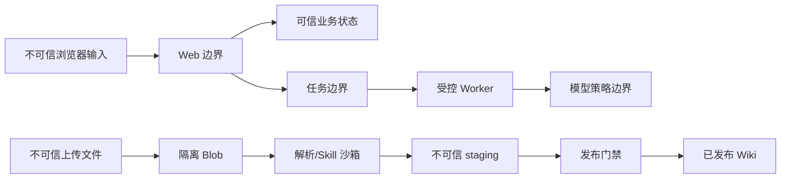

# 安全、部署与运维设计 v1

## 1. 安全目标

- 用户只能访问明确授权的组织和空间数据。
- 上传内容不能改变系统、Agent 或 Skill 权限。
- 模型和外部服务不能绕过数据出域策略。
- 原始证据、Wiki 和历史学习记录不可被无审计改写。
- 安装、升级、备份和恢复具有可验证步骤。

## 2. 信任边界



## 3. 访问控制

- 默认本地账号和邀请制，密码使用强哈希。
- Session token 只存哈希，Cookie 使用 HttpOnly、SameSite 和生产 Secure。
- 组织管理员禁用成员后，该成员在当前组织的每次组织/空间授权均立即失效；其全局会话和其他组织授权不受影响。Agent 历史读取、Binding 解析与 Worker 启动 Skill 前也必须重核 `organization_membership.disabled=false`；已暂停的 Binding 视为撤权，排队 Skill 在 Sandbox 前失败。平台级封禁才可使用 `app_user.disabled`。
- RBAC 在服务端执行；UI 隐藏按钮不能替代授权。
- 所有空间对象从 `spaceId` 反查权限，不接受客户端声明拥有者。
- 生产阶段支持 OIDC，外部身份映射不自动扩大角色。

## 4. 上传安全

- 文件扩展名、MIME、magic bytes 三方校验。
- 上传临时区与已发布 Blob 分离。
- 文件名不参与最终存储路径。
- 压缩文件限制嵌套深度、条目数、单条目大小和膨胀比。
- 解析任务使用资源限额，损坏文件不能拖垮 Worker 池。
- 可选恶意软件扫描作为发布前门禁。

## 5. 应用与 API 安全

- Zod 校验所有外部输入，Drizzle 参数化查询。
- 防 CSRF、XSS、开放重定向、SSRF 和路径穿越。
- API 按用户、公开业务对象、组织和模型预算限流；应用内公开限速不信任客户端 `X-Forwarded-For`/`X-Real-IP`，按源 IP 的防护仅由受信反向代理实现。
- 错误响应不包含堆栈、文件路径、SQL、模型密钥和正文。
- 来源预览使用授权后的受控流或短期签名 URL。

## 5.1 动态 Skill Sandbox 资源边界

- 动态 Skill 仅在 Linux Bubblewrap 沙箱执行，且必须保持无网络、只读输入/Skill 文件、独立产物/临时目录和进程组终止。
- manifest 的 `timeoutSeconds` 与 `memoryMb` 是执行契约：前者由 Worker 超时终止，后者转换为 Bubblewrap `--rlimit-as` 的每进程地址空间上限；运行时缺少 Bubblewrap 或不支持该命令时禁止宿主机回退。
- `--rlimit-as` 不等于同一 Worker 内的聚合物理资源配额。基础 Compose 为 Worker 声明可覆盖的 `2g` 内存、`2.0` CPU 与 `256` PID cgroup 限额；生产必须按节点容量和媒体并发调优，并在上线演练中核验 OOM/重启与队列恢复。
- 动态 Skill 不可携带自定义 shell、资源或挂载参数；运行错误只暴露稳定错误码，不记录 input、产物正文、绝对路径或环境变量。

## 6. 密钥与配置

- 开发使用 `.env`，生产使用 Docker Secret、KMS 或部署平台密钥存储。
- 数据库只保存 Provider 凭据引用或加密密文。
- cloud Provider 仅可使用受控 HTTPS host allowlist；每次调用先重核 DNS 结果，IPv4-mapped IPv6 按其底层 IPv4 的非公网地址规则拒绝，且禁止重定向。
- 支持密钥版本和轮换，不要求停机重建所有 Provider。
- 日志脱敏常见 token、Authorization、Cookie、密码和连接串。
- 配置启动时验证，缺少必要配置时失败退出。

## 7. 审计

必须审计：

- 登录成功/失败、会话撤销和账号禁用。
- 角色、成员和数据策略变更。
- 资源上传、版本、删除和下载。
- Wiki 编译、发布、审核、纠错和冲突裁决。
- Skill 安装、启用、审批和运行。
- 模型 Provider、路由策略和出域调用。
- 学习计划确认、正式题目发布、评分和人工复核。

审计记录只追加，导出时支持时间、用户、空间、动作和关联对象过滤。

## 8. 私有化部署

### 8.1 开发拓扑

```text
本机 Next.js + Worker + Docker PostgreSQL + 本地 data/
```

### 8.2 单机生产拓扑

```text
Reverse Proxy
├── web × 1..N
├── worker × 1..N
├── postgres
└── persistent volume / S3
```

- 基础 Compose 只允许容器网络内的 PostgreSQL 服务名连接；`POSTGRES_PASSWORD` 必填，根配置不发布 5432 宿主机端口。
- 仅开发者需要从宿主机执行 `pnpm db:*` 时，才叠加 `docker-compose.dev.yml`，它只绑定 `127.0.0.1`。该 override 不属于生产部署配置。

### 8.3 部门级拓扑

- Web、普通 Worker 和 GPU Worker 分池。
- PostgreSQL 主库和备份实例。
- S3 兼容对象存储。
- 集中日志、指标和告警。
- OIDC 与企业反向代理。

## 9. 备份一致性

备份单元必须包含：

- PostgreSQL 一致性快照。
- 原始 Blob。
- 已发布 Wiki 和 mappings。
- Schema/应用版本及备份清单。

`compiled/` 可按策略排除，但恢复后必须能重新生成。备份清单记录每个文件摘要和数据库恢复点。

恢复流程：

1. 部署匹配版本的应用但不开放流量。
2. 恢复 PostgreSQL。
3. 恢复 Blob、Wiki 和 mappings。
4. 校验摘要、资源版本引用和 Wiki sourceRefs。
5. 运行数据库与 Wiki 迁移。
6. 执行恢复验收后开放流量。

## 10. 升级与回滚

- 升级包声明应用版本、数据库迁移、Wiki Schema 迁移和最低前置版本。
- 先执行 preflight：容量、备份、版本、密钥和迁移兼容性。
- 数据库迁移遵循 expand → migrate → contract，避免一步破坏回滚。
- Wiki Schema 先支持双读，再批量迁移，最后停止旧写入。
- 回滚不能假设破坏性数据库迁移可逆；必须有备份恢复路径。

## 11. 监控与告警

| 级别 | 示例                                                |
| ---- | --------------------------------------------------- |
| P0   | 跨空间数据泄露、原件损坏、恢复失败                  |
| P1   | 登录整体失败、数据库不可用、队列停止、磁盘将满      |
| P2   | 某解析器高失败率、模型 Provider 故障、Wiki 冲突激增 |
| P3   | 单任务失败、预算接近阈值、黄金集指标下降            |

告警必须带可操作上下文和 runbook 指针。

## 12. 生产验收

- 全新环境按文档安装并通过健康检查。
- 备份恢复后数据库记录、原始 Blob、Wiki 和来源映射一致。
- 中断升级能够回滚或从备份恢复。
- 日志扫描不包含密钥、密码、Cookie 和完整敏感正文。
- 越权、路径穿越、压缩炸弹、SSRF、提示注入和 Skill 越权测试通过。
- 部门级目标负载下普通 API、队列延迟和查询延迟达到项目章程目标。
