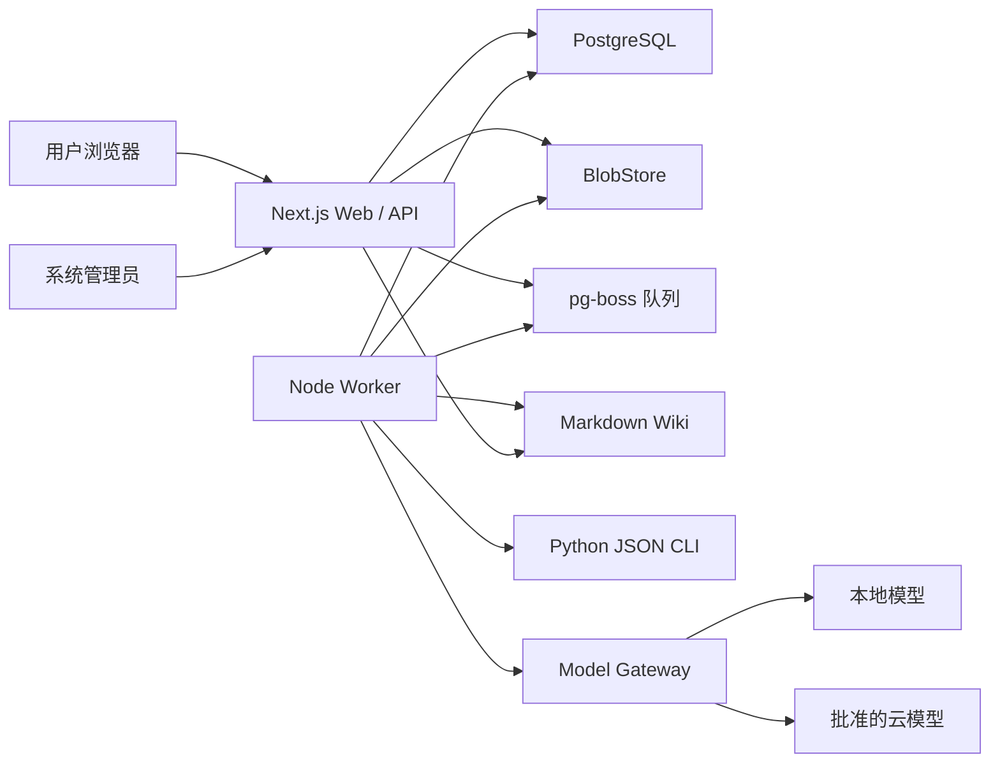
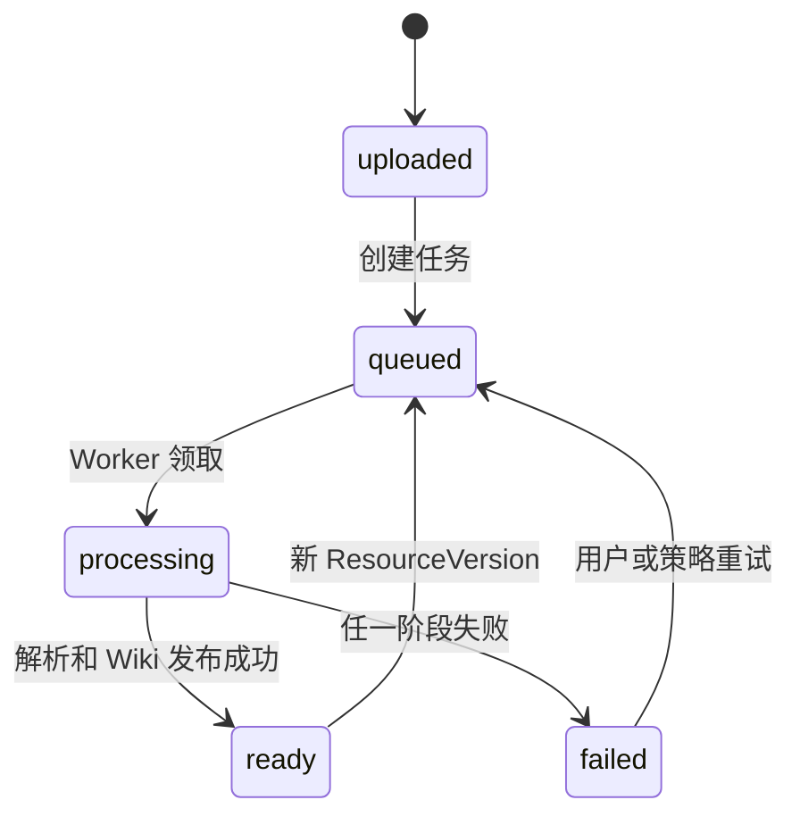
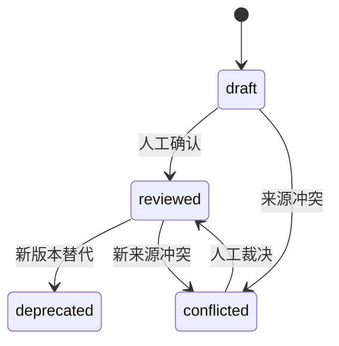
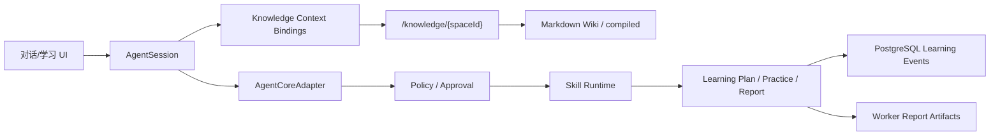

# Wknowledge 总体系统设计 v1

## 1. 设计目标

本设计把 Wknowledge 分为控制面、执行面、知识面和证据面，确保长任务、模型调用和不可信文件不会进入 Next.js 请求生命周期，同时保持私有化部署足够简单。

## 2. 系统上下文



## 3. 逻辑分层

| 层          | 责任                              | 允许依赖                           | 禁止行为                               |
| ----------- | --------------------------------- | ---------------------------------- | -------------------------------------- |
| UI          | 页面、交互、进度、阅读和来源预览  | Route API、contracts               | 直接读数据库和文件系统                 |
| HTTP 控制面 | 认证、校验、授权、状态查询、入队  | core、auth、contracts              | OCR、ASR、Wiki 编译、长模型调用        |
| 应用服务    | 业务事务、幂等、状态机、审计编排  | database、blob、wiki、runtime 接口 | 依赖 React/Next 页面                   |
| 执行面      | 文件解析、Skill、Agent、Wiki 发布 | core、Python CLI、model gateway    | 接收未授权的任意命令                   |
| 数据与知识  | 关系状态、Blob、Markdown、映射    | 基础设施实现                       | 让数据库和 Markdown 同时成为正文真相源 |
| 契约        | Zod、JSON Schema、领域类型        | 无业务实现                         | 反向依赖 Web、DB 或 Worker             |

依赖方向：

```text
apps/web ───────┐
                ├→ packages/core → database/blob/wiki/skill/model
apps/worker ────┘

packages/contracts → 不依赖业务实现
runtimes/python → 不访问业务数据库
```

## 4. 部署单元

### 4.1 必需组件

- `web`：Next.js Node 进程，承载 UI、Route Handlers 和 SSE。
- `worker`：Node 进程，消费 pg-boss 队列。
- `postgres`：业务数据、审计、任务状态和 pg-boss 表。
- `data volume`：原始 Blob、compiled、Wiki 和 mappings。

### 4.2 可选组件

- S3 兼容存储：替代本地 BlobStore。
- 本地模型服务：满足 `local_only`。
- GPU Worker：处理 OCR、ASR 和视频理解。
- 反向代理/OIDC/监控栈：生产加固阶段引入。

### 4.3 进程边界

- Web 与 Worker 必须是独立进程，不能在同一请求中内联执行任务。
- Python 由 Worker 以参数数组调用，只通过 stdin/stdout JSON 或文件契约通信。
- Skill 在受控工作目录中执行；原始资源只读，产物目录独立。
- 模型 Provider 只能通过 Model Gateway 调用，业务代码不直接使用供应商 SDK。

## 5. 数据所有权

| 数据                     | 真相源                           | 可重建       | 备份要求             |
| ------------------------ | -------------------------------- | ------------ | -------------------- |
| 用户、角色、会话         | PostgreSQL                       | 否           | 必须                 |
| 空间、资源元数据、版本   | PostgreSQL                       | 否           | 必须                 |
| 原始文件                 | BlobStore                        | 否           | 必须                 |
| 解析节点和媒体派生物     | `compiled/`                      | 是           | 可选，但恢复后可重建 |
| Wiki 正文与索引          | `wiki/`                          | 部分不可重建 | 必须                 |
| 来源映射                 | `mappings/` + PostgreSQL locator | 部分可重建   | 必须                 |
| 任务状态、审计、学习记录 | PostgreSQL                       | 否           | 必须                 |
| 检索缓存                 | 本地缓存/未来 FTS                | 是           | 不备份               |

数据库不保存原始正文和 Wiki 全文。Markdown 不保存权限和任务状态。

## 6. 核心状态机

### 6.1 资源处理



资源状态是用户视角；任务还必须记录 `stage/progress/errorCode/errorMessage/attempt`。

### 6.2 Wiki 页面



`reviewed + humanVerified` 页面不能被自动编译静默覆盖。

### 6.3 学习计划

```text
draft → confirmed/active → completed
                  └────→ archived
```

旧版本只读，新建议创建新版本。

## 7. API 设计原则

- API 以领域资源分组，不暴露文件系统路径。
- 所有输入在边界使用 Zod；所有错误使用统一 `ApiError`。
- 401 表示未认证，403 表示已认证但无权限，404 不泄露无权限对象存在性时可替代 403。
- 长任务返回 202 和 `jobId`；状态通过 GET 或 SSE 获取。
- 列表接口必须有分页、稳定排序和可选过滤。
- 所有写操作生成 request ID 和审计事件。
- API 版本破坏性变更必须使用 `/api/v2` 或兼容迁移期。

## 8. 一致性策略

跨 PostgreSQL 和文件系统无法使用单一事务，采用以下顺序：

### 8.1 上传

```text
写临时 Blob → 校验哈希/签名 → 原子发布不可变 Blob
→ 数据库事务写 Resource/Version/Job
→ 发送队列任务
```

数据库成功但队列发送失败时，Job 保持 `queued`，由 outbox/巡检器补发。最终实现不能只依赖请求内 `send()`。

### 8.2 Wiki 发布

```text
获取空间发布锁
→ 创建 staging
→ 编译页面与索引
→ Schema/链接/来源/冲突 Lint
→ 生成 diff 与发布清单
→ 原子替换 wiki 目录
→ 写发布记录和审计
→ 释放锁
```

数据库记录失败时保留可恢复发布清单，巡检器对齐数据库与磁盘状态。

## 9. 并发模型

- 上传可并发，去重范围限制在授权空间内。
- 同一 `ResourceVersion` 的同类任务使用幂等键去重。
- 资源解析可并行；同一知识空间 Wiki 发布必须串行。
- Skill Run 和模型调用均有并发、超时和预算限制。
- 学习事件追加写，掌握度是事件派生快照。

### 9.1 Agent 对话与学习编排



- Web 请求创建会话、消息或长任务；Agent/Skill 长运行进入 Worker，不占用 Route Handler。
- 虚拟知识路径由授权对象解析，不作为通用文件系统挂载暴露给 Agent。
- `AgentCoreAdapter` 隔离 Pi 或内部 Loop，第三方实现不能直接访问数据库和 BlobStore。
- 学习计划、题目、评分和报告使用领域服务写数据库；Agent 消息不能代替业务记录。
- 报告 PNG/PDF 由 Worker 从版本化报告 JSON 渲染并登记 Artifact。

## 10. 故障处理

| 故障           | 系统行为               | 恢复方式                   |
| -------------- | ---------------------- | -------------------------- |
| Worker 崩溃    | 租约到期后重试         | pg-boss retry，幂等任务    |
| Python 超时    | 终止子进程，任务失败   | 用户重试或管理员改解析器   |
| CSV 维度超限   | 解析前拒绝，不发布节点 | 拆分文件后重新导入         |
| XLSX 维度超限  | 解析前拒绝，不发布节点 | 拆分工作簿后重新导入       |
| 模型超时       | 按策略 fallback        | 不突破数据策略             |
| Wiki Lint 失败 | staging 隔离，线上不变 | 修复输入或 `wiki-correct`  |
| 数据库不可用   | Web 返回可诊断 503     | 数据库恢复后重试           |
| Blob 不可用    | 阻止新任务，保留状态   | 存储恢复后补偿             |
| 磁盘不足       | 任务停止，不删除原件   | 告警、扩容、清理可重建缓存 |

## 11. 可观测性

所有请求、任务、Skill Run 和模型调用必须共享关联字段：

```text
requestId / jobId / skillRunId / agentRunId / modelCallId
organizationId / spaceId / resourceVersionId / userId
```

必须采集：

- HTTP 请求量、错误率、P95。
- 队列深度、等待时间、成功率、重试和死信。
- 解析器耗时、页面数、输出节点数和失败类型。
- Wiki 发布耗时、变更页数、Lint 问题和冲突数。
- 模型调用次数、token/费用、延迟、fallback 和策略拒绝。
- 学习计划确认率、完成率、题目复核率和来源缺失率。

日志不得包含密码、密钥、完整敏感正文和未脱敏模型请求。

## 12. 架构演进边界

允许后续增加 PostgreSQL FTS、BM25、rerank 或向量缓存，但必须满足：

- Markdown 页面稳定 ID 不变。
- 删除缓存后仍能完成基础查询。
- 缓存不是知识真相源。
- v1 核心查询默认不调用 Embedding。
- 新检索方式通过独立 ADR 和黄金集证明收益。
