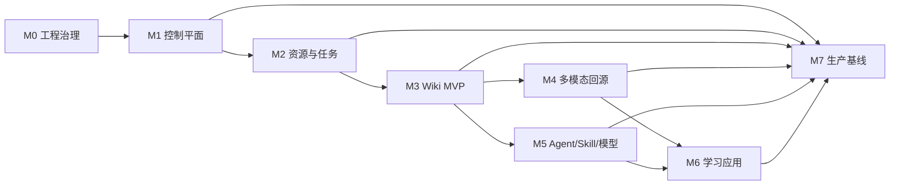

# Wknowledge 主实施计划 v1

## 1. 计划用途

本文件是项目唯一主实施顺序。它把项目章程和设计转换为工作包、依赖、交付物和退出门禁。任何功能开发必须先关联一个工作包 ID。

状态、负责人和验证证据不写在本文件里，统一维护在 `delivery-status-v1.md`，防止计划定义与执行事实混在一起。

## 2. 交付原则

- 先完成可验收的知识闭环，再扩展多模态、Agent 和学习应用。
- 每个里程碑必须完成“设计 → 实现 → 自动化验证 → 人工验收 → 文档/运维”全部工作。
- “接口/表/页面骨架存在”不等于能力完成。
- 未通过里程碑退出门禁，不得把该里程碑标记为已验收。
- 安全、迁移、审计和失败路径与主功能同一工作包交付，不留到最后补。

## 3. 状态定义

| 状态     | 定义                                              |
| -------- | ------------------------------------------------- |
| 未开始   | 只有需求或计划，没有可复用实现                    |
| 设计完成 | Spec/设计和验收标准稳定，尚未实现                 |
| 骨架完成 | 类型、接口、Schema 或占位 UI 存在，用户闭环未完成 |
| 开发中   | 已有实现，仍有必需子项或门禁未完成                |
| 已验证   | 自动化和人工功能验证通过，等待里程碑整体验收      |
| 已验收   | 全部退出标准、文档和运维交付完成                  |
| 阻塞     | 有明确外部依赖，记录解除条件                      |

## 4. 总体顺序与依赖



建议 2–5 人团队使用两周迭代。粗略工作量为 16–24 个迭代，实际排期在完成 M1/M2 复盘后校准，不把估算当承诺日期。

## 5. M0：工程治理与架构基线

目标：确保项目按同一套需求、设计、计划、状态和质量门禁推进。

| ID    | 工作包                 | 关键产物                                        | 依赖     |
| ----- | ---------------------- | ----------------------------------------------- | -------- |
| M0-01 | 项目章程与总需求       | `project-charter-v1.md`                         | 无       |
| M0-02 | 总体与分域设计         | system/knowledge/runtime/learning/security 文档 | M0-01    |
| M0-03 | 主实施计划与状态台账   | 本文件、`delivery-status-v1.md`                 | M0-01/02 |
| M0-04 | Harness 与文档闭环     | AGENTS/CLAUDE/INDEX/log                         | M0-03    |
| M0-05 | 单仓工程与根命令       | pnpm workspace、TS、ESLint、Vitest、Playwright  | M0-02    |
| M0-06 | CI 质量门禁            | format/lint/type/test/build/e2e                 | M0-05    |
| M0-07 | 测试夹具与验收记录模板 | fixtures、golden、acceptance 模板               | M0-06    |

退出门禁：

- 文档索引可以从总需求导航到设计、计划、状态和日志。
- 所有根命令真实存在且 CI 执行。
- Harness 13 项门禁通过。
- 当前代码基线和未完成项不被误标为完成。

## 6. M1：控制平面与权限

目标：形成可管理、可审计、空间隔离的单组织控制平面。

| ID    | 工作包     | 关键交付                        | 验证                    |
| ----- | ---------- | ------------------------------- | ----------------------- |
| M1-01 | 组织初始化 | 单组织、owner 初始化、幂等 seed | 重复 seed 不重复组织    |
| M1-02 | 本地认证   | 登录、登出、会话过期、密码策略  | 401、撤销后失效         |
| M1-03 | 用户管理   | 邀请、启用/禁用、角色变更       | 禁用立即失效            |
| M1-04 | 空间管理   | CRUD、归档、数据策略            | owner/admin/editor 边界 |
| M1-05 | 空间成员   | 邀请、角色、移除                | 跨空间隔离集成测试      |
| M1-06 | 审计       | 统一审计服务和查询 UI           | 写操作覆盖率报告        |
| M1-07 | BlobStore  | 本地/S3 接口、不可变写、受控读  | 路径穿越与冲突测试      |
| M1-08 | 管理 UI    | 登录、用户、空间、成员、审计    | Playwright 管理流程     |
| M1-09 | 安全基线   | CSRF、Cookie、限流、错误脱敏    | 安全测试                |

退出门禁：

- 未登录 401；无权限访问不泄露对象；跨空间读取测试全部失败关闭。
- owner/admin/editor/learner/viewer 的允许和拒绝矩阵有自动化测试。
- 文件正文不进入业务表。
- 管理员能够通过 UI 完成邀请、禁用和空间成员管理。

## 7. M2：资源上传、版本与任务系统

目标：稳定完成文件接收、不可变版本、后台解析和可诊断任务。

| ID    | 工作包   | 关键交付                                    | 依赖        |
| ----- | -------- | ------------------------------------------- | ----------- |
| M2-01 | 上传协议 | 小文件 multipart、分片、续传、配额          | M1-04/07    |
| M2-02 | 文件安全 | MIME/signature、压缩炸弹、文件名            | M2-01       |
| M2-03 | 资源版本 | Resource/Version、替换、历史版本            | M2-01       |
| M2-04 | 事务补偿 | 临时 Blob、outbox、孤儿巡检                 | M2-03       |
| M2-05 | 队列     | pg-boss、幂等键、优先级、并发               | M1-06       |
| M2-06 | 任务韧性 | retry、timeout、dead letter、cancel、resume | M2-05       |
| M2-07 | 进度协议 | stage/progress/SSE、断线重连                | M2-05       |
| M2-08 | 标准节点 | CompiledNode v1、parser manifest            | M2-03       |
| M2-09 | 基础解析 | TXT/MD/CSV/PDF/DOCX                         | M2-08       |
| M2-10 | 处理 UI  | 实时进度、失败详情、重试、历史版本          | M2-06/07/09 |
| M2-11 | 故障测试 | Worker 崩溃、重复投递、磁盘不足             | M2-04/06    |

退出门禁：

- 新文件、重复文件和替换版本三个流程 E2E 通过。
- Worker 在 parsing/persist/wiki 前后崩溃均可安全恢复。
- 上传后 UI 自动更新到 ready/failed，无需手动刷新。
- 失败显示阶段、错误码、摘要和可执行重试。

## 8. M3：Markdown LLM Wiki MVP

目标：交付用户可浏览、可查询、可审核、可回源的 Markdown 知识库。

| ID    | 工作包      | 关键交付                                     | 依赖        |
| ----- | ----------- | -------------------------------------------- | ----------- |
| M3-01 | Wiki Schema | Frontmatter、稳定 ID、页面类型、迁移         | M2-08       |
| M3-02 | 空间索引    | 根索引、分域索引、摘要和别名                 | M3-01       |
| M3-03 | 编译器      | extracted/synthesized、材料拆页、幂等合并    | M2-09/M3-01 |
| M3-04 | 冲突策略    | conflicted、并列事实、人工裁决               | M3-03       |
| M3-05 | 人工审核锁  | reviewed 页面 diff/approval                  | M3-03       |
| M3-06 | 发布协议    | 空间锁、staging、manifest、原子发布          | M3-03       |
| M3-07 | Lint        | Schema、链接、来源、索引、敏感模式           | M3-06       |
| M3-08 | Wiki API    | 目录、列表、页面、版本、diff、审核           | M3-02/07    |
| M3-09 | Wiki UI     | 知识库导航、阅读器、状态、来源面板           | M3-08       |
| M3-10 | Query       | index-first、证据包、自然语言回答、拒答      | M3-02/M5-06 |
| M3-11 | 查询记录    | 候选、引用、模型调用、Embedding=0            | M3-10       |
| M3-12 | 黄金集      | 100 资料、50+ 问题、Recall@10                | M3-09/10    |
| M3-13 | Wiki 组件化 | Knowledge Component Port、Repository 与 Tool | M3-10/M5-13 |

退出门禁：

- 用户可以从 UI 查看已处理 Wiki 文档，而不只是资源状态。
- 长资料能够拆分为多个带独立来源的可搜索页面。
- 重复编译、冲突、人工审核、并发发布和 Lint 失败测试通过。
- 删除缓存后仍可完成查询。
- 黄金集 Recall@10 ≥ 85%，无依据问题正确拒答。
- 依赖树无向量数据库客户端，查询记录 Embedding 调用为 0。

## 9. M4：多模态解析与精确回源

目标：让 PDF、Office、图片、音频和视频形成可验证的结构节点和来源预览。

| ID    | 工作包          | 关键交付                             |
| ----- | --------------- | ------------------------------------ |
| M4-01 | PDF 精确解析    | 阅读顺序、bbox、表格、扫描件 OCR     |
| M4-02 | PPTX            | Shape、备注、图片、表格              |
| M4-03 | XLSX/CSV        | range、公式、显示值、合并单元格      |
| M4-04 | 图片            | OCR bbox、区域、视觉描述             |
| M4-05 | 音频            | ASR、时间戳、分段、可选说话人        |
| M4-06 | 视频            | 音轨、字幕、关键帧、画面 OCR/描述    |
| M4-07 | Python CLI 协议 | Schema、版本、超时、错误与安全       |
| M4-08 | 来源内容 API    | 授权流、范围读取、历史版本           |
| M4-09 | 来源预览 UI     | PDF/media/sheet/slide/document/image |
| M4-10 | 定位评测        | 分类型准确率报告                     |

退出门禁：

- PDF 抽样定位准确率 ≥ 95%。
- 音视频定位误差不超过一个转写片段。
- 表格、幻灯片和文档引用打开正确位置。
- 历史引用继续打开历史资源版本。

## 10. M5：Agent、Skill 与模型路由

目标：把智能能力放入可授权、可限制、可审计的运行时。

| ID    | 工作包              | 关键交付                                                                  |
| ----- | ------------------- | ------------------------------------------------------------------------- |
| M5-00 | 开源框架适配 Spike  | Pi/OpenCode/Claude 模式、许可、安全和替换性                               |
| M5-01 | 运行记录 Schema     | session/run/tool/skill/model/artifact                                     |
| M5-02 | Agent Loop          | 多轮消息、流式事件、`knowledge.search/read`、受控 Skill、停止和上下文裁剪 |
| M5-03 | Skill Registry      | 发现、安装、版本、digest、兼容性                                          |
| M5-04 | Policy Engine       | 系统/组织/空间/角色/manifest 交集                                         |
| M5-05 | Approval            | 参数摘要、资源范围、过期和审计                                            |
| M5-06 | SkillRun 与 Sandbox | Run/Outbox/队列、文件、进程、资源、网络隔离                               |
| M5-07 | TS/Python Skill     | 统一输入输出、产物和错误协议                                              |
| M5-08 | Provider Registry   | 能力、模型、密钥引用和健康检查                                            |
| M5-09 | Model Routing       | 数据策略、allowlist、fallback、预算                                       |
| M5-10 | 对话运行 UI         | 类 Codex/Claude 会话、范围路径、流式回答、工具/Skill、审批和独立来源区    |
| M5-11 | 安全验证            | 注入、越权、出网、资源耗尽                                                |
| M5-12 | 知识上下文绑定      | 多空间选择、受管虚拟路径、版本证据和撤权                                  |
| M5-13 | Pi Core 生产适配器  | Pi Agent Loop、事件、模型与工具桥接                                       |
| M5-14 | Agent Skills 兼容   | `SKILL.md`、受管 ResourceLoader、安装快照                                 |
| M5-15 | 组件 Tool Registry  | Tool Schema、Policy/Approval Hook、审计                                   |
| M5-16 | Pi 会话持久化桥接   | Session/Event Repository、本地与服务器投影                                |

退出门禁：

- 无网络 Skill 从系统层面无法出网。
- 原始文件写入、超时、超内存和未批准动作被阻断。
- 上传文档不能修改 Agent 权限。
- 每次输出可追溯到 Skill digest、模型和来源。
- 会话可恢复、停止和继续；知识上下文只允许已授权虚拟路径。
- 替换 Pi/OpenCode 适配器不改变 Wknowledge 领域契约和历史记录。

## 11. M6：学习应用

目标：完成从知识到计划、学习、练习、测评和掌握度的闭环。

| ID    | 工作包          | 关键交付                                                       |
| ----- | --------------- | -------------------------------------------------------------- |
| M6-01 | 学习域 Schema   | goal/course/unit/kp/question/attempt/review                    |
| M6-02 | 学习画像        | declared/observed/inferred 与纠正                              |
| M6-03 | 学习计划        | 选材/目标、Skill 候选、确认、版本、调整                        |
| M6-04 | 课程编排        | module/unit/kp/resource/activity                               |
| M6-05 | 学习事件        | 追加事件、进度重建                                             |
| M6-06 | 练习生成        | 已学范围、知识点、难度、来源、候选与审核                       |
| M6-07 | 测评发布        | 题卷版本、规则、时间和权限                                     |
| M6-08 | 作答与评分      | 客观确定性、主观量表、复核                                     |
| M6-09 | 错题与掌握度    | 证据快照、时间衰减、解释                                       |
| M6-10 | 学习 UI         | 目标、计划、课程、练习、测评、结果                             |
| M6-11 | 学习 Skill      | diagnose/plan/course/question/rubric                           |
| M6-12 | 原文学习器      | 固定版本 text/PDF/image/audio/video 阅读、播放、位置恢复和定位 |
| M6-13 | 学习报告        | 结构报告、HTML、PNG/PDF Artifact 与回查                        |
| M6-14 | Assessment 组件 | 候选、题卷、作答、评分、复核 Tool/API                          |
| M6-15 | Learning 组件   | 计划、课程、事件、进度和报告 Tool/API                          |

退出门禁：

- 用户确认后计划才生效。
- 学习事件可重建进度。
- 每道正式题目可打开知识依据。
- 知识更新不改变历史评测证据。
- 用户可以纠正 AI 学习状态推断。
- 用户可从所选内容生成计划，并在学习单元打开固定版本原文。
- 练习结果入库后能生成指标一致、可回查的报告图片。

## 12. M7：私有化生产加固

目标：系统可被非开发者按文档安装、运行、升级和恢复。

| ID    | 工作包               | 关键交付                                            |
| ----- | -------------------- | --------------------------------------------------- |
| M7-01 | 镜像与 Compose       | pinned image、非 root、healthcheck                  |
| M7-02 | 配置与密钥           | preflight、secret、轮换、脱敏                       |
| M7-03 | 数据库迁移           | expand/migrate/contract、升级检查                   |
| M7-04 | Wiki Schema 迁移     | 双读、迁移、校验、回退                              |
| M7-05 | 备份恢复             | DB/Blob/Wiki 一致性清单和演练                       |
| M7-06 | 监控告警             | HTTP、队列、解析、模型、容量                        |
| M7-07 | 限流与预算           | 用户/组织/IP/Provider                               |
| M7-08 | 审计导出             | 检索、导出和保留策略                                |
| M7-09 | 性能压测             | 部门级目标和容量建议                                |
| M7-10 | 安全测试与复扫整改   | 越权、SSRF、压缩炸弹、注入、沙箱；复扫 `R1–R6` 闭环 |
| M7-11 | 运维文档             | 安装、升级、备份、恢复、runbook                     |
| M7-12 | 可移植运行档案       | SQLite/PostgreSQL、local queue/pg-boss Port         |
| M7-13 | 核心迁移与旧组件清理 | 双路径对比、默认切换、回退、旧入口和死配置删除      |
| M7-14 | 本地 App 安装验收    | 一键初始化、升级、备份恢复和完整知识/考试闭环       |

退出门禁：

- 全新环境安装验收通过。
- 至少一次完整备份恢复演练通过。
- 中断升级有可执行恢复路径。
- 日志和导出无密钥、密码和完整敏感正文。
- 安全与部门级压测报告通过。

## 13. 每个工作包的完成定义

工作包只有同时满足以下条件才可标记“已验证”：

- Spec/设计已更新，边界和错误行为明确。
- 实现与依赖方向符合总体设计。
- 正常、拒绝、失败和恢复路径均有测试。
- API/数据库/文件 Schema 有兼容与迁移说明。
- UI 有 loading、empty、error、success 和权限状态。
- 日志、审计和可观测字段完整。
- format、lint、typecheck、test、build 通过；完整流程追加 E2E。
- `delivery-status-v1.md` 附验证证据，执行日志记录结论和缺口。

## 14. 关键路径与并行建议

关键路径：

```text
M1 权限 → M2 任务/节点 → M3 Wiki API/UI → M4 回源
→ M5 Pi 安全运行时 → M3-13 Wiki 组件 → M6 Assessment/Learning 组件
→ M7-12 可移植运行档案 → M7-13 清理 → M7-14 本地与服务器验收
```

可并行：

- M1 管理 UI 与 BlobStore。
- M2 上传协议、队列韧性和解析器契约。
- M3 Wiki 阅读 UI、编译器和黄金集工具。
- M4 Office、OCR、ASR、视频与预览器。
- M5 Sandbox、Model Gateway 和运行记录 UI。
- M5-14 Agent Skills 与 M7-12 SQLite Adapter 可在 Pi Adapter 稳定后并行。

不可并行越过的门禁：没有 M2 标准节点不做 M4；没有 M3 可浏览 Wiki 不开始学习题目；没有 M5 权限/审计不启用外部 Skill 和云模型；没有 Pi Tool/Policy Bridge 不迁移考试与学习生成；没有两个观察窗口旧调用为 0 不删除旧生产路径。
